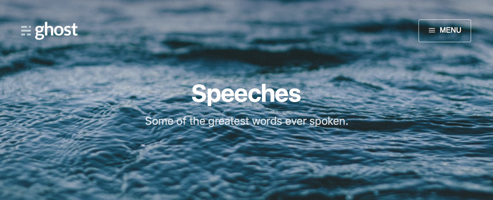

## Pasper
[](https://travis-ci.org/Poi-Son/Pasper)
[](https://travis-ci.org/Poi-Son/Pasper)
[](https://travis-ci.org/Poi-Son/Pasper)

Pasper修改自[jasper](https://github.com/biomadeira/jasper)，主题来自于[Casper](https://github.com/TryGhost/Casper)。

Pasper由于对jasper做了比较大的修改，因此另开了一个仓库。Pasper更合在中国国内使用。
## Live demo
[Pasper Live Demo](http://pasper.yerl.cn)

## Pasper改进
- 移除了多用户支持
- 优化导航栏的设计，修改`_data/navs.yml`即可以修改导航栏
- 优化tags设计，修改`_data/tags.yml`可以为post添加默认的Header Image
- 添加百度统计，同时支持Google Analytics
- 添加多说评论系统，同时支持disqus
- 添加redcarpet的一些插件

## 使用说明
### 布署博客
**重要说明：** 由于安全原因，GitHub Pages在编译发布博客的时候，不允许插件运行(位于_plugins/目录下)。这意味着：

**1)** 我们需要在本地生成HTML网页，然后将生成的网页push到GitHub仓库里。

**2)** 使用[travis-ci](https://travis-ci.org/)自动生成HTML网页，然后帮我们将生成的网页push到GitHub仓库里。

如果你选择**1)**方案的话，那么你可以直接将本仓库里的代码clone到本地，然后在该目录中执行`jekyll s`命令，然后将生成的`_site`目录中的内容上传到你的仓库(username.github.io)，GitHub Pages就会将这个网页发布出来。

如果你选择**2)**方案的话，你需要fork本仓库，并修改`.travis.yml`文件，并正确配置[travis-ci](https://travis-ci.org/)。在这以后，每次你更新博客并push到仓库，travis-ci将会被触发，并自动开始编译博客，几分钟后，你的博客就已经被更新了。

### 发布文章
使用jekyll发布博客，要求博客文章顶部编写`Front Matter`，格式如下：

```
---
layout: post
title: Blogging Like a Hacker
---
```
Pasper大幅减少`Front Matter`的数量，并增加可定义的内容。

```
---
layout: post
date: 2014-08-12 10:18:00
title: The Businessman & the fisherman
tags: Fables Fiction
cover: 'assets/images/cover7.jpg'
---
```

- layout: 必选，一般填post即可，代码这个是一篇博客
- date: 必选，博客发布日期
- title: 必选，博客标题
- tags: 可选，博客分类
- cover: 可选，为博客选定标题的图片背景，如果没有此选项，则默认查找分类的图片

### 编辑草稿
未完成的博客，我们不希望被发布出来，那么，你可以将草稿放在`_drafts`目录下。在本地编辑的时候，可以在目录执行`jekyll s -D`命令，那么，你在本地就可以预览到该博客了。

### 编辑侧边栏
Pasper将侧边栏的数据保存在`_data/navs.yml`中，修改此文件可以方便地定制侧边栏的菜单链接。

```
# 右侧菜单栏栏目
- name: Home
  url: ""
  
- name: About
  url: "about"
  
- name: Fables
  url: "tag/Fables"
  
- name: Speeches
  url: "tag/Speeches"

- name: Fiction
  url: "tag/Fiction"

```


### 编辑Tag
Pasper将Tag的数据保存在`_data/tags.yml`中，修改此文件可以为Tag选定默认的背景图片。当属于此Tag的Post(博客)没有设置`cover`属性时，将继承于Tag的`cover`属性。

```
- name: Fables
  cover: assets/images/cover2.jpg
  description: A series of short stories that make you think.
  
- name: Speeches
  cover: assets/images/cover7.jpg
  description: Some of the greatest words ever spoken.

- name: Fiction
  cover: assets/images/cover1.jpg
  description: A 6-post collection
```


## 感谢
非常感谢Ghost团队设计工作，带来如此美观的博客。

## Copyright & License

Copyright (C) 2016 - Released under the MIT License.

Permission is hereby granted, free of charge, to any person obtaining a copy of this software and associated documentation files (the "Software"), to deal in the Software without restriction, including without limitation the rights to use, copy, modify, merge, publish, distribute, sublicense, and/or sell copies of the Software, and to permit persons to whom the Software is furnished to do so, subject to the following conditions:

The above copyright notice and this permission notice shall be included in all copies or substantial portions of the Software.

THE SOFTWARE IS PROVIDED "AS IS", WITHOUT WARRANTY OF ANY KIND, EXPRESS OR IMPLIED, INCLUDING BUT NOT LIMITED TO THE WARRANTIES OF MERCHANTABILITY, FITNESS FOR A PARTICULAR PURPOSE AND NONINFRINGEMENT. IN NO EVENT SHALL THE AUTHORS OR COPYRIGHT HOLDERS BE LIABLE FOR ANY CLAIM, DAMAGES OR OTHER LIABILITY, WHETHER IN AN ACTION OF CONTRACT, TORT OR OTHERWISE, ARISING FROM, OUT OF OR IN CONNECTION WITH THE SOFTWARE OR THE USE OR OTHER DEALINGS IN THE SOFTWARE.
